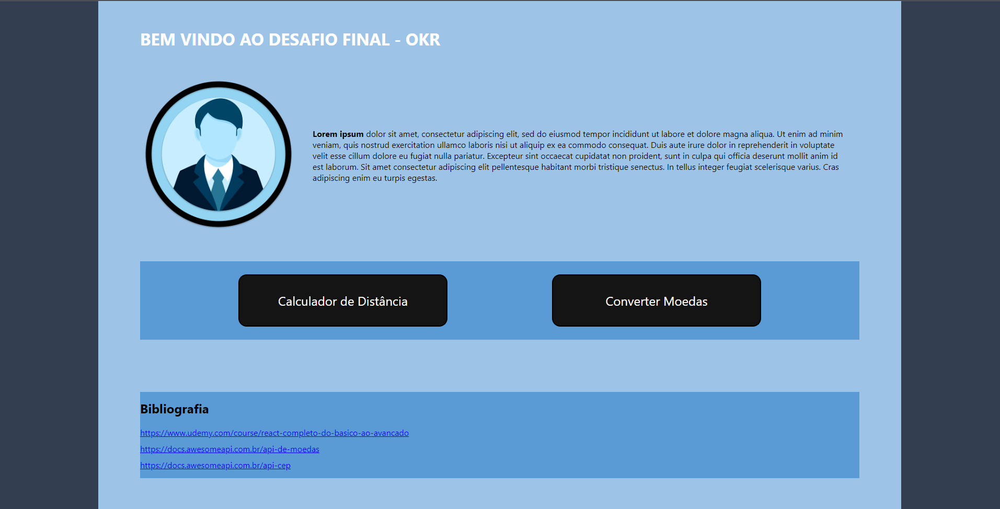
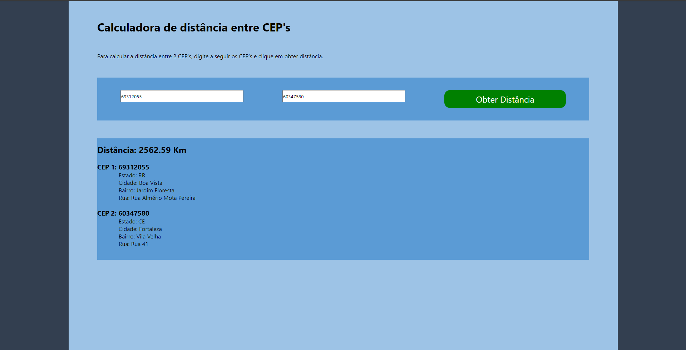
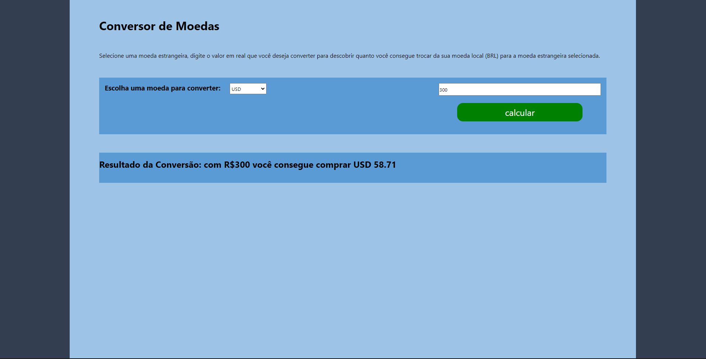

## Available Scripts

In the project directory, you can run:

### `npm install`

### `npm start`

Runs the app in the development mode.\
Open [http://localhost:3000](http://localhost:3000) to view it in your browser.

Aplicação realizada para avaliação na formação de ReactJS na empresa AX4B.

Foi criado uma aplicação onde há uma página principal a qual tem 2 links para páginas com diferentes funcionalidades.

Também há uma seção de referencias com as APIs utilizadas para consumo nas páginas de CEP e Moedas.

Página inicial:

Página de calculo de distancias:

Nesta página o usuário informa 2 CEPs, e quando é clicado em consultar, é feita a consulta na API de CEPs e executa uma função a qual calcula a distancia entre os 2 CEPS, trazendo na tela também as informações de cada CEP digitado.

Página de conversão de moedas:

Nesta página o usuário seleciona uma moeda que deseja que seja feita a conversão de Reais. Quando submetido a aplicação faz uma requisição para a API de moedas e traz o resultado do valor que seria possível comprar da respectiva moeda com o valor X de reais.

Você consegue utilizar a aplicação aqui: https://teste-final-okr.herokuapp.com/
